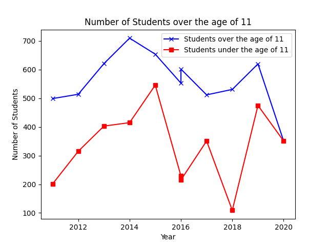
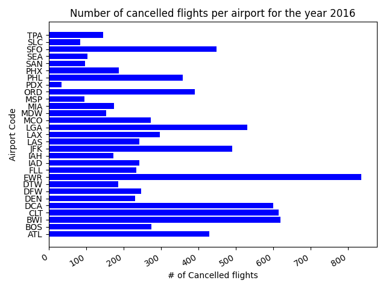

# Freya's Project02

## Project Overview/Description

 
The purpose of this project was to serve as practice downloading, reading, manipulating, and plotting data from JSON and CSV files. Below you will find a line graph created from data obtained from CSV files and a bar graph created from a downloaded JSON file. The appropriate data descriptions can be found below both graphs.

 
 

## Comparison of the Number of Students Above and Below the Age of 11 in District 186 

 

 

The line plots above are representative of a school's student population. The blue line shows the number of students between the years 2011 and 2020 that were over the age of 11, conversely, the red line represents the number of students in the school district that were under the age of 11. As expected, the population of students under the age of 11 never exceeds the number of students above the age of 11. The dataset I used was created and posted by GitHub user mukulbindal on the repository linked <a href="https://github.com/mukulbindal/Files " target="_blank">here</a>.

 
 

## Number of Cancelled Flights at Each Airport in the Year 2016

 

 

The bar graph shown above illustrates the amount of monhtly airline cancellations by airport for the year 2016. The dataset contains a list of dictionaries that contain monthly delay information by airport for the years 2003 through 2016. I wanted to look specifically at the number of cancelled flights per airport for the most recent year the dataset contained, 2016. The data is arranged in descending alphabetical order, Atlanta being at the bottom. The dataset I used can be accessed <a href="https://github.com/jdorfman/awesome-json-datasets#travel" target="_blank">here</a>.

 
 

## Link to the Instructions for Project_02

 

If you're curious about the criteria for this project, please check out Mike's GitHub repository linked <a href="https://github.com/mikeizbicki/cmc-csci040/tree/2022fall/project_02" target="_blank">here</a>.